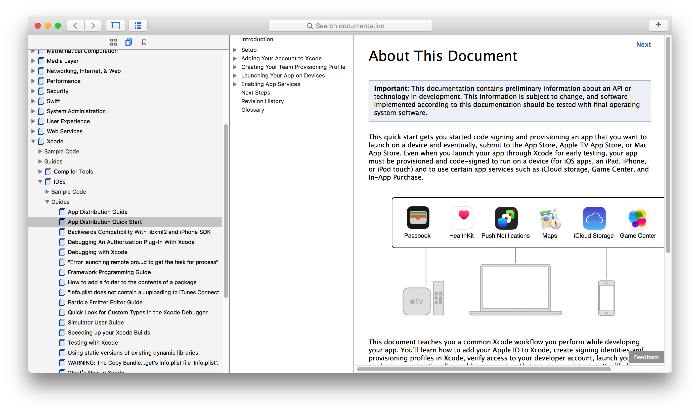
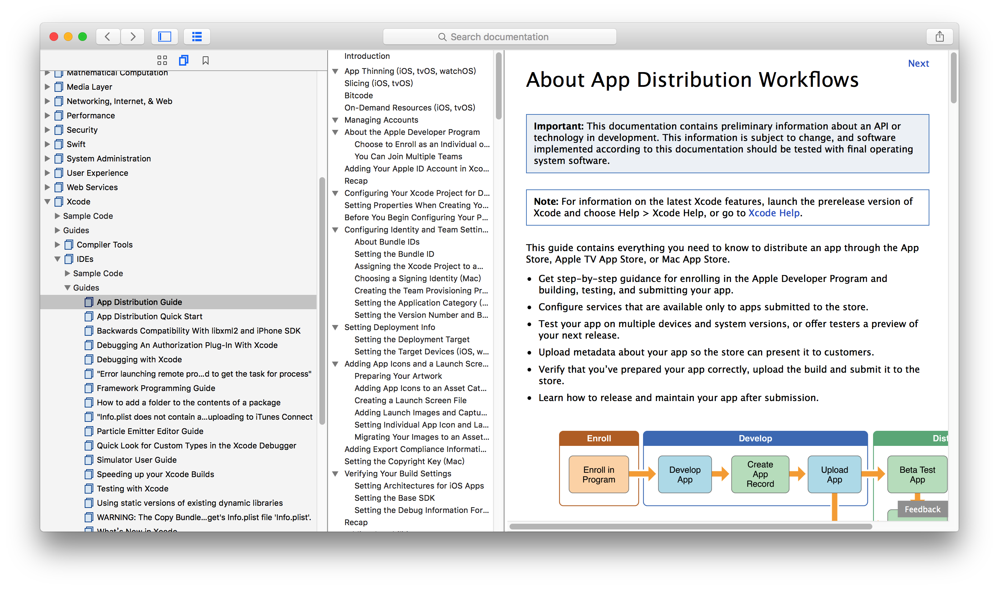

#APP-Distribution-Guide

翻译，go~

>知识是人类进步的阶梯

### 翻译文件来源
iOS Documentation and API Reference

Xcode -> IDEs -> Guides -> App Distribution Quick Start | App Distribution Guide

### Xcode、SDK版本
Xcode 7.3 | iOS 9.3

### 阅读提示
请先阅读 App Distribution Quick Start 

再阅读 App Distribution Guide

App Distribution Quick Start 是 App Distribution Guide 的简述，也可说是前言。
