#APP-Distribution-Quick-Start(快速上手app开发及上架)

翻译，GO~知识是人类进步的阶梯

>本文适用于刚准备学iOS开发的小白

## 关于本文

主要是为了让你快速上手代码签名和配置一个运行到设备上且最终上架到App Store、Apple TV App store或者Mac App Store的app。在这几种情况下，你的app必须是配置证书并成功签名了的，1.通过Xcode对app做早起的测试，2.真机运行，3.使用了苹果提供的核心服务功能，如：iCloud storage，Game Center，and In-App Purchase

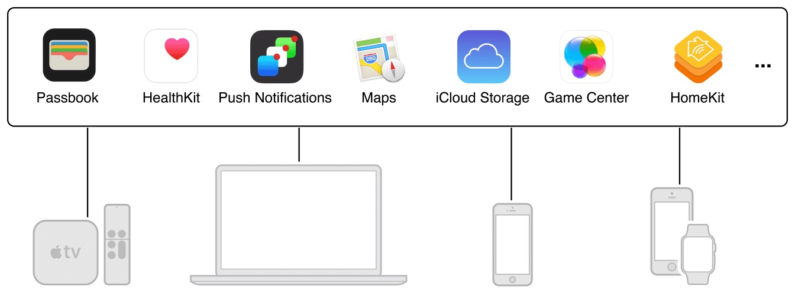

本文教你在开发应用时通用的Xcode工作流程，你将会学到这些内容，1.如何在Xcode中添加Apple ID，2.在Xcode中创建证书并配置对应文件，3.验证访问你的开发者账户，4.真机调试，5.给app添加功能配置对应证书文件。你还将学到经验，例如备份你的签名身份。

### 另请参阅

本文是App Distribution Guide（app开发上架指南）的前奏，App Distribution Guide一文全面覆盖了开发所有阶段和可选可配置的工作流程，例如发布你的Mac应用但是不上架到Mac App Store。阅读App Distribution Guide，你将全面掌握配置文件、发布应用、解决遇到的问题，当然你得继续阅读本文，遇到不懂的专业词汇，请参见术语表（附件）。

### 准备工作

接下来的一切内容如果没有特别声明的地方，均适用于各大平台（iOS，tvOS，watchOS，Mac）

前提条件：

 + 一台Mac电脑，最好已经装有Xcode 7.1
 + 为了最好的体验效果，安装最新的OS X系统和Xcode
 + 用Xcode创建一个没有任务错误、正常运行的项目

另外，你可以选择加入苹果开发者计划，这样就可以使用苹果各大平台提供的功能服务。如果你不加入开发者计划，你给你的app添加的官方功能服务就受限制了，不过最终，你必须加入开发者计划才能向商店发布你的应用。

### 安装最新的Xcode

Xcode是苹果集成的开发工具（IDE），是你开发应用的主要工具。它包含源代码编辑器、图形界面编辑器、及很多其它的特性。Xcode简化了证书配置和代码签名过程，在开发阶段中，你不用离开Xcode。在后续的发布阶段，你会用到Xcode和其它工具将应用提交测试和发布到应用商店

想装最新的Xcode，前往Mac App Store。

### 创建Xcode工程

如果你没有现成的可运行无误的Xcode工程项目，你可以创建一个简单的应用用来在本文中学习代码签名和配置应用

创建应用步骤

1. 打开Xcode

2. 选择File > New > Project,或者在“Welcome to Xcode”面板中点击“Create a new Xcode project”

3. 在你想要创建的平台选项下选择“Application”,从对应的模板列表中选择一个，然后点击“Next”

    例如，创建一个iOS空窗口应用，选择“Single View Application”，创建Mac应用选择“OS X”的“Cocoa Application”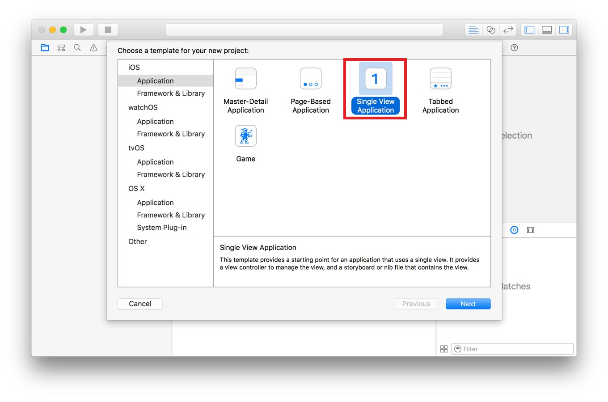

4. 在出现的对话框中，填写Product Name和Company Identifier。

    Company Identifier应该以反向DNS格式来填写，如果你没有公司标识，就填写 `com.example.你的名字` ，等以后有了，再更改掉。d对话框中其它的内容需要现在就完成，下面的截图展示了创建iOS应用的填写，对于tvOS、watch OS和Mac应用，选项大同小异。

5. 在Language弹出框中选择一个编程语言

6. 点击“Next”

    会有一个对话框让你选择在哪儿保存当前的工程文件

7. 为工程文件的保存指定一个位置，可以选择取消选中“Create git repository on”，然后点击“Create”
    对于iOS应用，一个新的窗口出现了，类似于下图：

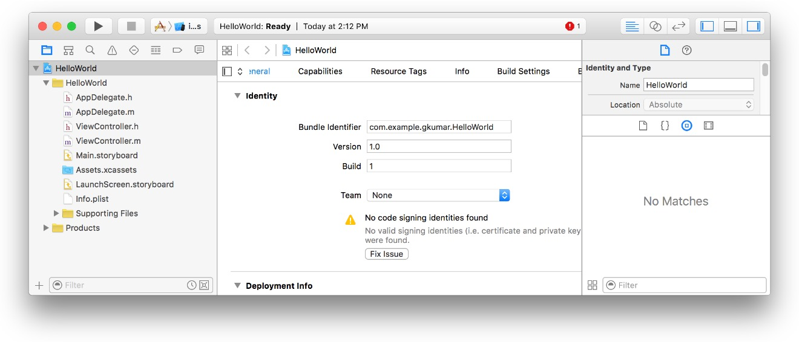

### 购买开发者计划

如果你将发布应用上架到商店或者使用TestFlight进行测试，你最需要加入苹果开发者计划或者加入一个已经购买了开发者计划的组织。

购买开发者计划，请前往 [Apple Developer Program Enrollment](https://developer.apple.com/programs/enroll//) ，按照指示操作。

---

## 在Xcode中添加你的账户

当你向Xcode > preferences > account中添加Apple ID时，Xcode将向你展示你属于哪个组织，同时还会告诉你你在组织中的角色以及那些你接下来将在本文中创建证书和配置文件的详情。如果你没有购买开发者计划，将把个人组织情况展示给你。

### 关于开发者计划

苹果开发者计划给你发布应用提供了一切需要的东西，你购买该计划，就可以提交iOS应用、watchOS应用到App Store，Mac应用到Mac App Store，tvOS应用到Apple TV App store。当然，你还可以不通过Mac App Store发布你的Mac应用，你还可以在对应的平台上，给应用添加苹果特殊的功能服务，另外，你还可以使用更多的工具，用你的开发账号和iTunes Connect管理机构和应用的元数据。

你用属于你的特别且唯一的Apple ID，购买企业开发者计划，你可以创建一个以你为主的组织团队，当然，你也可以购买个人或者公司级别（也就是被看做一个人的团队）的开发者计划。谁创建了团队谁就是团队的总代理，是合法的成员管理者，有所有权去管理开发账 [developer.apple.com/account](https://developer.apple.com/account) 和操作iTunes Connect。

用企业开发者计划账号可以添加他人分配角色及定义个人的特权，一个团队管理员角色几乎拥有组织团队总代理的所有权限。比如说，管理员角色可以管理整个团队而不需要任何批准，团队成员在得到团队总代理或者管理的允许后可以真机调试和给应用添加核心功能服务。

购买开发者计划，请前往 [Apple Developer Program Enrollment](https://developer.apple.com/programs/enroll//) ，按照指示操作。

### 在Xcode中添加关联Apple ID

**在开始证书配置之前，先向Xcode中添加你的Apple ID**

1. 选中顶部的 Xcode > Preferences.

2. 在弹出窗口的顶部点击"Accounts"

3. 在左下角点击“+”按钮

4. 在弹出视图中选择"Add Apple ID"

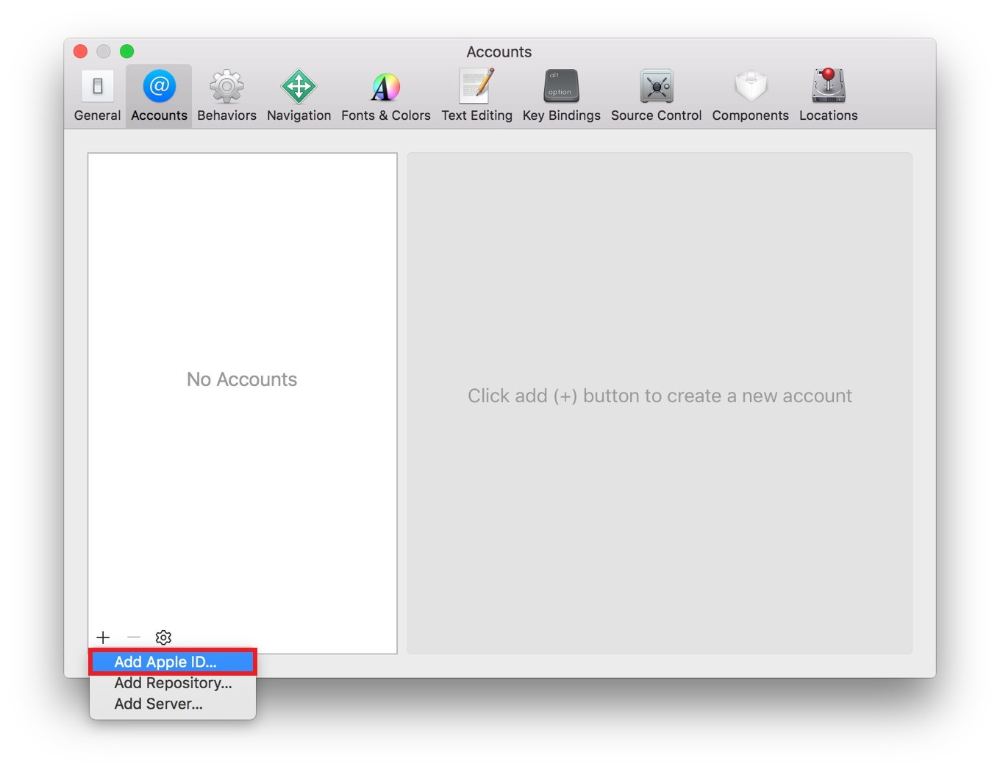

5.在对话框中输入Apple ID和密码，点击"Sign In"

    在OS X 10.11以后，如果你开启了两步验证Apple ID，你可能需要输入额外的验证码（点击 [Frequently asked questions about two-step verification for Apple ID](https://support.apple.com/en-us/HT204152) 了解更多）,在早期的系统环境下，你可能需要输入一个应用特定的密码（点击 [Using app-specific passwords](https://support.apple.com/en-us/HT204397) 学习如何生成一个app特定的密码）。

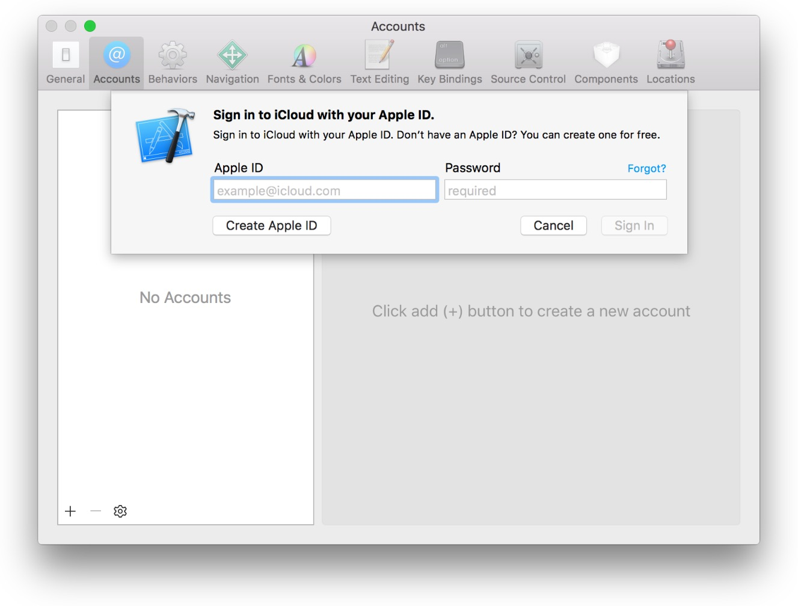

6. 如果你没有Apple ID，点击对话框左下角的"Create Apple ID"按钮，创建Apple ID后，重复以上步骤。

## 验证你的账户

如果你购买了开发者计划，Xcode会代表你使用你的Apple ID凭证登录你的开发者账户和iTunes Connect， 偶尔你需要登录你的开发者账户和iTunes Connect执行任务，在此之前，请确认Xcode和你本人能正常使用相关工具。

### 验证你的Xcode账户凭证

在Xcode中验证你能在Preferences > Accounts中找到你的Apple ID并可以查询到账户详细内容。

1. 如果有需要，选择 Xcode > Preferences，然后在顶部点击"Accounts"

    你选中的那个Apple ID所属组织展示到你的眼前，在Name那一列写着组织名称，如果该组织加入了开发者计划，那么你的角色将出现在iOS或者Mac列，否则，“Free”出现在平台列。

    没有购买开发者计划的个人，现在可以真机调试和使用某些苹果提供的核心功能服务（详情参见 **App Distribution Guide（app开发上架指南）** 中的 _**Supported Capabilities（功能支持表）**_)），但是他们不能发布iOS、tvOS、watchOS等应用给消费者。

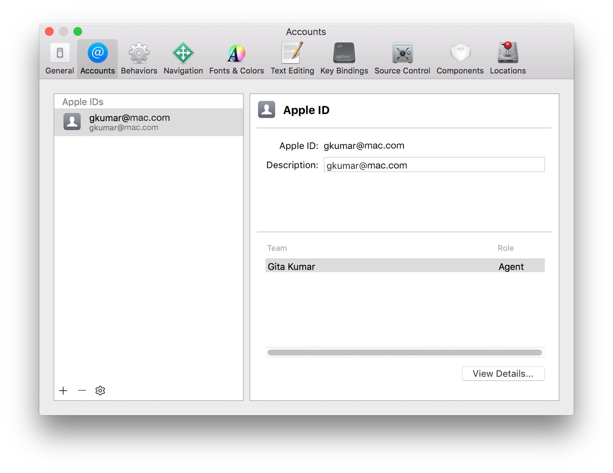

2. 选择你想查看的team，然后点击“View Details”

    在弹出的对话框中，查看签名证书和配置文件，如果是你第一次对app进行签名，表格中不会有签名证书或者配置文件，替代的是在证书的每一行的”action“列出现”Create“按钮

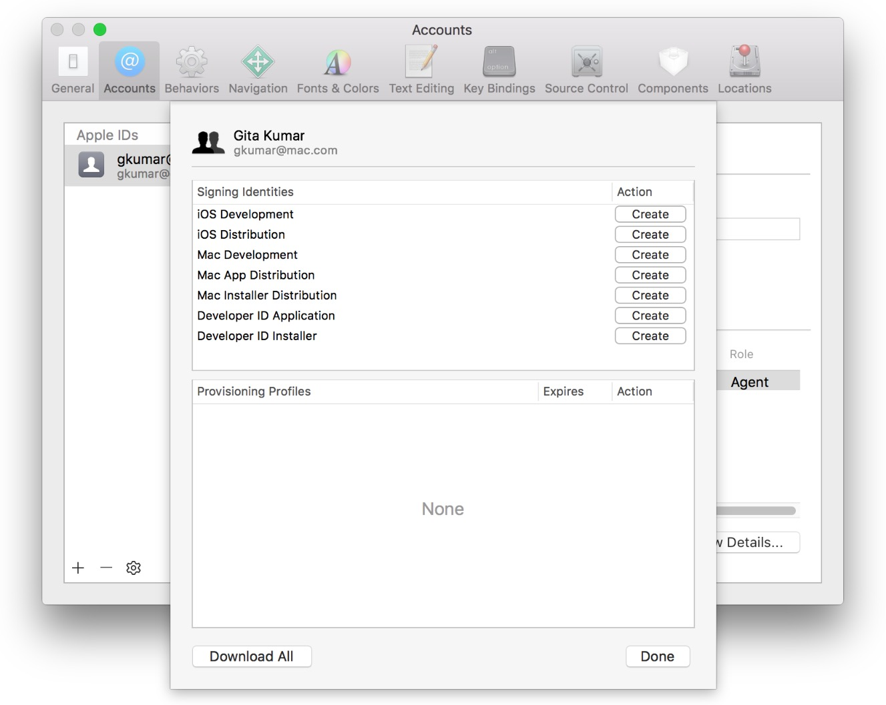

3.点击”Done“关闭对话框

### 验证你的开发账户证书

验证你有权限操作在开发者账号中的证书、标识和配置文件，且这些文件与Xcode中的相一致

1. 用你的浏览器，打开网址 [developer.apple.com/account](https://developer.apple.com/account)

2. 再出现的对话框中，输入你的Apple ID和密码，点击”Sign In“

3.点击”Certificates，Identifiers & Profiles“

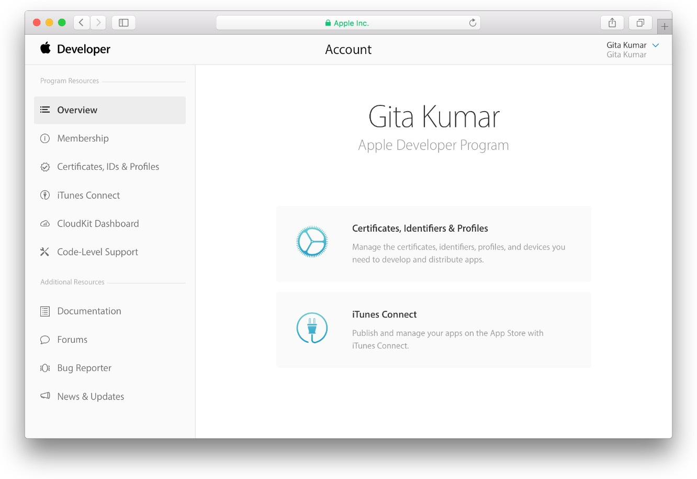

4. 从左上角的下拉框”iOS，tvOS， watchOS“中，选择一个平台（tvOS和watchOS都包含在iOS中），对于Mac应用，选择OS X

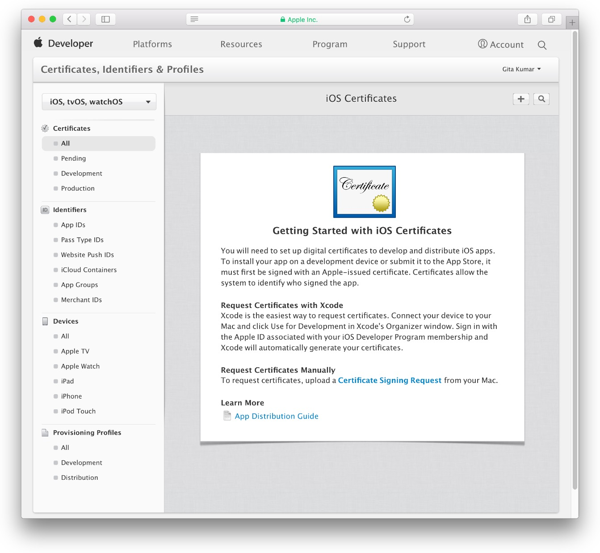

另外，从浏览器中直接进入到 [Certificates, Identifiers & Profiles](https://developer.apple.com/account/ios/certificate) 网页，你将要用你的开发者账号走认证流程，所以目前别退出登录。

### 验证你的iTunes Connect证书

你通过iTunes Connect输入你的行政机构和app的相关信息，信息甚至包含一些将要内置的功能服务-内购和游戏中心。如果你是一个购买了开发者计划的企业机构代理或者个人，你可以随便登录iTunes Connect，但是如果你只是团队的一个普通成员或者是团队的管理者角色，除非总代理单独创建一个iTunes Connect账号供你使用，否则你是无权限登录iTunes Connect的。

虽然在这个文档中用不到iTunes Connect，但是现在做一个iTunes Connect证书的验证。

1. 登录 [developer.apple.com/account](https://developer.apple.com/account)，然后在左侧点击”iTunes Connect“

2. 选中”Take me straight to iTunes Connect...“ and click Go to iTunes Connect。

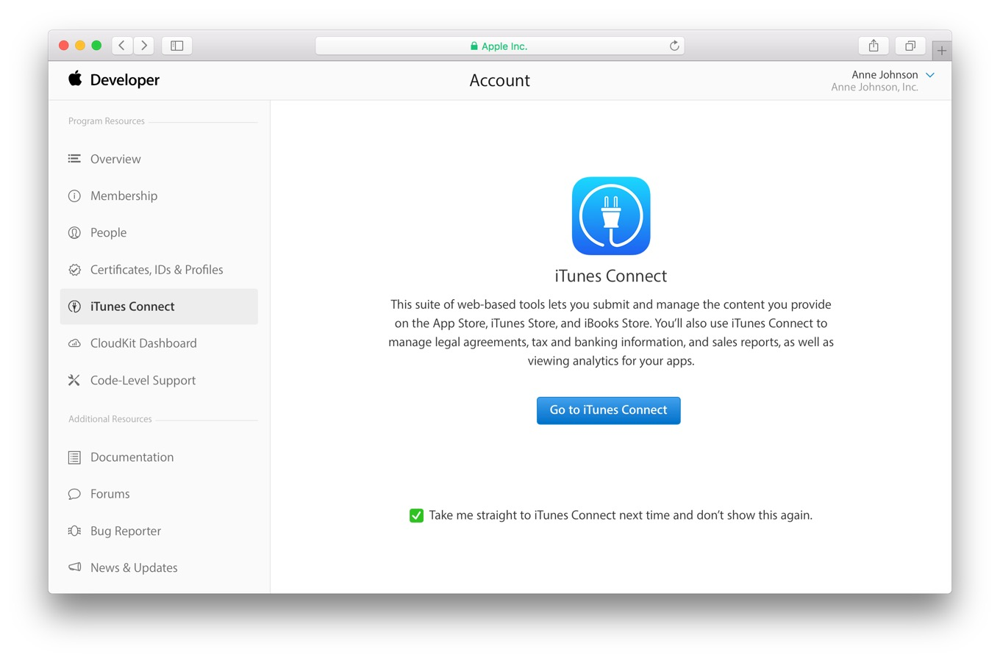

    iTunes Connect主页上展示了我的应用，用户和角色，还有其它模块。

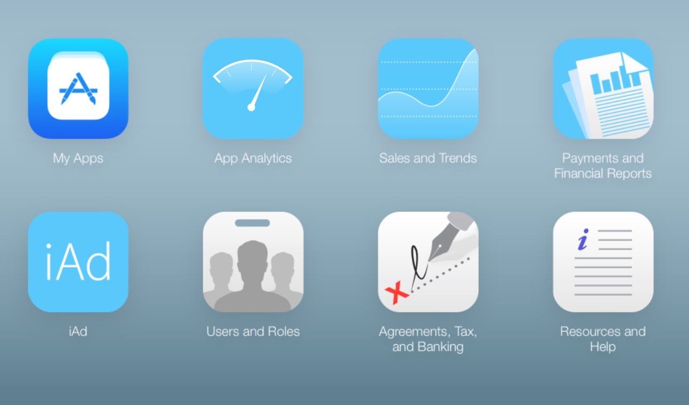

    然后，你将可以在iTunes Connect中的 My Apps 这一栏输入应用的相关信息。

3. 在右上角，你可以从弹出视图中选择”Sign Out“，退出

另外，登录到 [itunesconnect.apple.com](https://itunesconnect.apple.com)，更多了解iTunes Connect请阅读iTunes Connect Developer Guide（iTunes Connect开发指南）。

