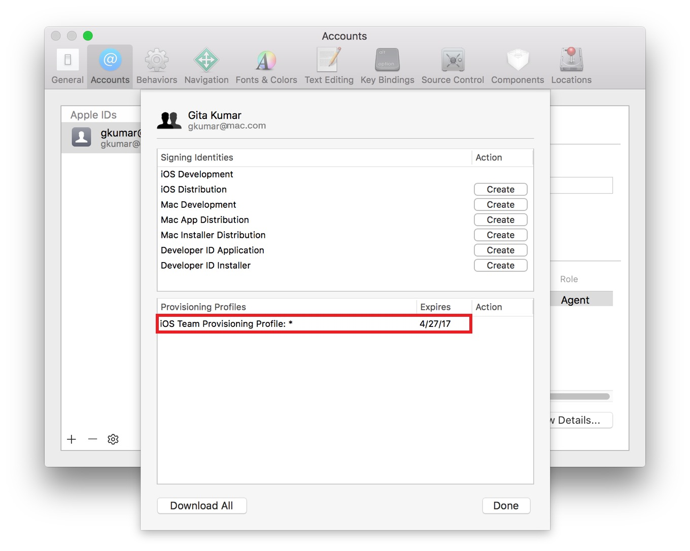

#APP-Distribution-Quick-Start（快速上手app开发及上架）

翻译，GO~知识是人类进步的阶梯

>本文适用于正在自学iOS开发的小白

## 关于本文

主要是为了让你快速上手**代码签名和配置文件，将一个app运行到设备上，最终上架到App Store、Apple TV App store或者Mac App Store**。当你通过Xcode对app做早期的测试、真机运行、添加了特定应用服务，如：iCloud storage（云存储），Game Center（游戏中心），In-App Purchase（内购）等，你的app必须是配置好了并代码签名了的

本文教你在开发时通用的Xcode工作流程，你将会学到如何在Xcode中添加Apple ID、在Xcode中创建证书并配置对应文件、验证访问你的开发者账户、真机调试、给app添加功能配置对应证书文件。你还将学到经验技巧，例如备份你的签名身份。

### 另请参阅

本文是App Distribution Guide（app开发上架指南）的前奏，App Distribution Guide一文全面覆盖了开发所有阶段和可选可配置的工作流程，例如发布你的Mac应用但是不上架到Mac App Store。阅读App Distribution Guide，你将全面掌握配置文件、发布应用、解决遇到的问题，当然你得继续阅读本文，遇到不懂的专业词汇，请参见术语表（附件）。

### 准备工作

接下来的一切内容如果没有特别声明的地方，均适用于各大平台（iOS，tvOS，watchOS，Mac）

前提条件：

 + 一台Mac电脑，最好已经装有Xcode 7.1
 + 为了最好的体验效果，安装最新的OS X系统和Xcode
 + 用Xcode创建一个没有任务错误、正常运行的项目

另外，你可以选择加入苹果开发者计划，这样就可以使用苹果各大平台提供的功能服务。如果你不加入开发者计划，你给你的app添加的官方功能服务就受限制了，不过最终，你必须加入开发者计划才能向商店发布你的应用。

### 安装最新的Xcode

Xcode是苹果集成的开发工具（IDE），是你开发应用的主要工具。它包含源代码编辑器、图形界面编辑器、及很多其它的特性。Xcode简化了证书配置和代码签名过程，在开发阶段中，你不用离开Xcode。在后续的发布阶段，你会用到Xcode和其它工具将应用提交测试和发布到应用商店

想装最新的Xcode，前往Mac App Store。

### 创建Xcode工程

如果你没有现成的可运行无误的Xcode工程项目，你可以创建一个简单的应用用来在本文中学习代码签名和配置应用

创建应用步骤

1. 打开Xcode

2. 选择File > New > Project,或者在“Welcome to Xcode”面板中点击“Create a new Xcode project”

3. 在你想要创建的平台选项下选择“Application”,从对应的模板列表中选择一个，然后点击“Next”

    例如，创建一个iOS空窗口应用，选择“Single View Application”，创建Mac应用选择“OS X”的“Cocoa Application”

    

4. 在出现的对话框中，填写Product Name和Company Identifier。

    Company Identifier应该以反向DNS格式来填写，如果你没有公司标识，就填写 `com.example.你的名字` ，等以后有了，再更改掉。d对话框中其它的内容需要现在就完成，下面的截图展示了创建iOS应用的填写，对于tvOS、watch OS和Mac应用，选项大同小异。

5. 在Language弹出框中选择一个编程语言

6. 点击“Next”

    会有一个对话框让你选择在哪儿保存当前的工程文件

7. 为工程文件的保存指定一个位置，可以选择取消选中“Create git repository on”，然后点击“Create”
    对于iOS应用，一个新的窗口出现了，类似于下图：

    

### 购买开发者计划

如果你将发布应用上架到商店或者使用TestFlight进行测试，你最需要加入苹果开发者计划或者加入一个已经购买了开发者计划的组织。

购买开发者计划，请前往 [Apple Developer Program Enrollment](https://developer.apple.com/programs/enroll//) ，按照指示操作。

---

## 在Xcode中添加你的账户

当你向Xcode > preferences > account中添加Apple ID时，Xcode将向你展示你属于哪个组织，同时还会告诉你你在组织中的角色以及那些你接下来将在本文中创建证书和配置文件的详情。如果你没有购买开发者计划，将把个人组织情况展示给你。

### 关于开发者计划

苹果开发者计划给你发布应用提供了一切需要的东西，你购买该计划，就可以提交iOS应用、watchOS应用到App Store，Mac应用到Mac App Store，tvOS应用到Apple TV App store。当然，你还可以不通过Mac App Store发布你的Mac应用，你还可以在对应的平台上，给应用添加苹果特殊的功能服务，另外，你还可以使用更多的工具，用你的开发账号和iTunes Connect管理机构和应用的元数据。

你用属于你的特别且唯一的Apple ID，购买企业开发者计划，你可以创建一个以你为主的组织团队，当然，你也可以购买个人或者公司级别（也就是被看做一个人的团队）的开发者计划。谁创建了团队谁就是团队的总代理，是合法的成员管理者，有所有权去管理开发账 [developer.apple.com/account](https://developer.apple.com/account) 和操作iTunes Connect。

用企业开发者计划账号可以添加他人分配角色及定义个人的特权，一个团队管理员角色几乎拥有组织团队总代理的所有权限。比如说，管理员角色可以管理整个团队而不需要任何批准，团队成员在得到团队总代理或者管理的允许后可以真机调试和给应用添加核心功能服务。

购买开发者计划，请前往 [Apple Developer Program Enrollment](https://developer.apple.com/programs/enroll//) ，按照指示操作。

### 在Xcode中添加关联Apple ID

**在开始证书配置之前，先向Xcode中添加你的Apple ID**

1. 选中顶部的 Xcode > Preferences.

2. 在弹出窗口的顶部点击"Accounts"

3. 在左下角点击“+”按钮

4. 在弹出视图中选择"Add Apple ID"

    

5. 在对话框中输入Apple ID和密码，点击"Sign In"

    在OS X 10.11以后，如果你开启了两步验证Apple ID，你可能需要输入额外的验证码（点击 [Frequently asked questions about two-step verification for Apple ID](https://support.apple.com/en-us/HT204152) 了解更多）,在早期的系统环境下，你可能需要输入一个应用特定的密码（点击 [Using app-specific passwords](https://support.apple.com/en-us/HT204397) 学习如何生成一个app特定的密码）。

    

6. 如果你没有Apple ID，点击对话框左下角的"Create Apple ID"按钮，创建Apple ID后，重复以上步骤。

## 验证你的账户

如果你购买了开发者计划，Xcode会代表你使用你的Apple ID凭证登录你的开发者账户和iTunes Connect， 偶尔你需要登录你的开发者账户和iTunes Connect执行任务，在此之前，请确认Xcode和你本人能正常使用相关工具。

### 验证你的Xcode账户凭证

在Xcode中验证你能在Preferences > Accounts中找到你的Apple ID并可以查询到账户详细内容。

1. 如果有需要，选择 Xcode > Preferences，然后在顶部点击"Accounts"

    你选中的那个Apple ID所属组织展示到你的眼前，在Name那一列写着组织名称，如果该组织加入了开发者计划，那么你的角色将出现在iOS或者Mac列，否则，“Free”出现在平台列。

    没有购买开发者计划的个人，现在可以真机调试和使用某些苹果提供的核心功能服务（详情参见 **App Distribution Guide（app开发上架指南）** 中的 _**Supported Capabilities（功能支持表）**_），但是他们不能发布iOS、tvOS、watchOS等应用给消费者。

    

2. 选择你想查看的team，然后点击“View Details”按钮

    在弹出的对话框中，查看签名证书和配置文件，如果是你第一次对app进行签名，表格中不会有签名证书或者配置文件，替代的是在证书的每一行的”Action“列出现”Create“按钮

    

3.点击”Done“关闭对话框

### 验证你的开发账户证书

验证你有权限操作在开发者账号中的证书、标识和配置文件，且这些文件与Xcode中的相一致

1. 用你的浏览器，打开网址 [developer.apple.com/account](https://developer.apple.com/account)

2. 再出现的对话框中，输入你的Apple ID和密码，点击”Sign In“

3. 点击”Certificates，Identifiers & Profiles“

    

4. 从左上角的下拉框”iOS，tvOS， watchOS“中，选择一个平台（tvOS和watchOS都包含在iOS中），对于Mac应用，选择OS X

    

另外，从浏览器中直接进入到 [Certificates, Identifiers & Profiles](https://developer.apple.com/account/ios/certificate) 网页，你将要用你的开发者账号走认证流程，所以目前别退出登录。

### 验证你的iTunes Connect证书

你通过iTunes Connect输入你的行政机构和app的相关信息，信息甚至包含一些将要内置的功能服务-内购和游戏中心。如果你是一个购买了开发者计划的企业机构代理或者个人，你可以随便登录iTunes Connect，但是如果你只是团队的一个普通成员或者是团队的管理者角色，除非总代理单独创建一个iTunes Connect账号供你使用，否则你是无权限登录iTunes Connect的。

虽然在这个文档中用不到iTunes Connect，但是现在做一个iTunes Connect证书的验证。

1. 登录 [developer.apple.com/account](https://developer.apple.com/account)，然后在左侧点击”iTunes Connect“

2. 选中”Take me straight to iTunes Connect...“ and click Go to iTunes Connect。

    

    iTunes Connect主页上展示了我的应用，用户和角色，还有其它模块。

    

    然后，你将可以在iTunes Connect中的 My Apps 这一栏输入应用的相关信息。

3. 在右上角，你可以从弹出视图中选择”Sign Out“，退出

另外，登录到 [itunesconnect.apple.com](https://itunesconnect.apple.com)，更多了解iTunes Connect请阅读iTunes Connect Developer Guide（iTunes Connect开发指南）。

### 小结

在本章中，你学会了如何在Xcode中添加Apple ID，以及购买开发者计划的途径。同时你也学会了怎么样登录开发者账号和iTunes Connect，在下一章，你将学会如何创建签名证书和配置文件（Signing identity 和 provisioning profile）。

---

## 创建你的团队配置文件

如果你输入关于你app的信息、分配了一个团队去开发app，Xcode会为你创建必要的签名证书和配置文件。特别是，Xcode创建一个团队配置文件使你的app能在你所有的设备上运行，并且可以是用苹果提供的功能服务。对于iOS 和 tvOS应用，要想调试就要将设备连接到Mac，对于watchOS应用，连接到一个iPhone和一个Apple Watch是标配。

Provisioning 是准备、配置app、运行在设备上、使用苹果功能服务的过程，在开发阶段，你可以选择支持哪些设备可以运行你的应用，你的应用支持苹果提供的哪些功能。A Provisioning Profile 可以从你的开发者账号下载并导入到app的沙盒包中，并且使得整个包都被签名了。而导入到app的Provisioning Profile在应用运行到设备上之前，会安装到设备上。如果该文件不满足一定条件，应用将不会运行起来。你可以通过Xcode中的选项配置开发使用provisioning profile。

为了节省你的时间，Xcode为你创建并管理了一系列开发配置证书，被称为”a team provisioning profile“（团队配置证书）。该证书允许你的应用被你所有团队成员运行在你们所有的设备上。对于个人开发者，该证书可以使你的应用运行你的所有设备上。Xcode还提供了你为集成对应功能时按需生成对应配置证书的步骤，尽管Xcode简化了这些过程，但是依旧可以帮助你理解你的代码签名和配置文件，以及知晓他们保存在哪儿。

Xcode根据需要创建配置文件，这是你的开发者账户完整的需要。如果开发者证书丢失了，Xcode会帮你请求一个，开发者证书会在团队配置文件中用来验证你的身份，一个设备必须注册并创建一个配置文件，这样Xcode才可以允许你连接iOS或者tvOS设备，对于Mac应用，Xcode会在运行时自动注册当前mac设备。

bundle ID是一个独一无二的标识，保存在你应用的沙盒里，Xcode创建一个与之相匹配的App ID，一个App ID用来标识你的一个或者多个应用，App ID会与应用的bundle ID进行比较来判定它是否匹配。App ID可以是一个显式的App ID，也可以是一个通配的App ID，同时和多个应用相匹配。Xcode在有需要的情况下会创建一个通配的ID和一个显式的ID。例如，如果你启用苹果应用程序服务，需要一个显式ID，那么Xcode会创建一个显式ID和一个新的团队配置文件。因此，在你的开发者账户中，你可能拥有一个被所有应用共用的团队配置文件和多个具体用途的配置文件。Xcode会为iOS、tvOS和Mac等应用分开创建团队配置文件。

你使用一个签名证书去给应用代码签名。当Xcode请求你的开发者证书时，证书和它的公钥保存在你的开发者账户中，而签名的证书和公钥及私钥保存在你的keyChain中，没有私钥你就无法完成代码签名。

### 设置Bundle ID

应用一旦在商店上架后，它的bundle ID是不能再更改的。所以现在检查确认，若有需要现在改正，如果你现在还没有购买开发者计划，你可以等以后再执行这一操作。

应用商店和应用服务使用bundle ID去确保应用是独一无二的。bundle ID应该按照DNS反向命名，创建新工程的时候，Xcode会默认连接公司标识和工程名称-例如，Xcode连接 `com.example.ajohnson` 和   `MyFirstApp` 创建一个名为 `com.example.ajohnson.MyFirstApp` 的Bundle ID，不同于域名，bundle ID是区分大小写的，你可能更愿意使用小写命名bundle ID或者用不同的前缀。

若要改变bundle ID，改掉它的公司前缀标识符，另外，在 `info.plist` 或项目编辑器窗口修改整个项目的bundle ID，而后，你得在iTunes Connect中输入同样的bundle ID。

**在Xcode中修改bundle ID前缀**

1. 显示项目导航器（顶部导航条），选择 View > Navigators > Show Project Navigator.

2. 从 Project/Targets 一栏的弹出视图中，选中第二行

3. 点击 General ，如果有需要的话，继续点击左侧的三角箭头

4. 在bundle ID的编辑区域，重写bundle ID的前缀

    

### 关联app到一个团队

你可以用同一个Apple ID加入多个开发者团队-例如你可以购买个人开发者计划之后又加入到另外一个团队。因此,Xcode项目需要分配给一个特定的团队，这样Xcode知道创建代码签名和配置文件。如果你不属于苹果开发者计划,你会自动识别为个人团队的一员。

**关联Xcode工程项目到一个团队**

1. 在项目面板上，查看 identity 的设置

    如果有需要，选中 target ，点击 General， 点击左侧的三角形详情箭头找到设置信息

2. 对于Mac应用，选中 signing identify

    如果你想提交应用到Mac store，就选中 Mac App Store。如果你想发布但是不在Mac Store上架或者你不是开发者，选中Developer ID 或者 Apple ID。

    

3. 从弹出视图菜单中选择一个团队

    如果你是个人开发者，选择你的名字，如果你不属于开发者，选择你个人团队。

    

如果你已经连接了一个设备或者以前注册了一个设备，Xcode可能视图创建一个团队配置文件。在Team处弹出视图下方的警告消息可能会改变，在下一章你将学会处理各种问题。

### 创建团队配置文件

Xcode替代你进行了很多步骤创建团队配置文件，节省了你不少时间。例如，Xcode自动注册你的设备和请求开发者证书，这两项都是创建团队配置证书所需要的。这些步骤都是在你点击Fix Issue按钮的时候完成的。Xcode在你关联你的应用到一个团队 或者 在Preferences > Accounts中更新配置文件的时候也会走这些步骤。

提示：如果没有警告消息，也没有Fix Issue按钮出现，那么说明Xcode已经帮你创建好了团队配置文件，你可以跳过这些步骤

**创建团队配置文件**

1. 在项目导航器，如果有需要，选择 target，点击 General，然后点击Identity旁边的三角形展示设置信息

2. 对于iOS，watchOS和tvOS应用，连接你想调试的设备到Mac上，在Scheme选中后的弹出视图中选择它。

    如果你能从弹出视图中选出那台设备，那就说该设备是可以用来注册的。

    

    如果你的设备是不合适的，在继续之前先解决点报错。例如，如果这台设备与该项目部署目标不匹配，那升级设备的操作系统或者选择一个合适的部署版本，设备匹配后，再次选中该设备。

3. 从Team的弹出视图中选择一个Team

4. 如果出现了 ”Fix Issue“按钮，直接点击它

    如果Xcode创建团队配置文件成功了，那警告消息就会消失。如下图所示

    

### 导出你的签名证书保存私钥

在创建完团队配置证书后，导出你的签名证书用来保存私钥，Xcode导出所有签名证书和配置文件到一个文件，签名文件包含你的公钥和私钥，所以你可以在另一台Mac上导入该文件然后继续对你的应用代码进行签名，你首先得导出要保存私钥的集合，因为签名证书代表着你存储证书、文件加密的身份，应该存储在一个安全的地方。如果你从钥匙链删除了你的私钥，丢失了备份，那么你需要重新创建相关证书

**导出你的签名证书**

1. 选择 Xcode > Preferences

2. 在窗口的顶部点击”Accounts“

3. 选择你想查看的团队，点击”View Details“按钮

4. 点击窗口左下角齿轮状按钮，在删除键的右边，在弹出视图中选择 ”Export Developer Accounts“

    

5. 在Save As文本框中输入一个文件名，然后输入密码和验证输入密码，文件是加密的，密码受保护的

6. 点击”Save“按钮

    文件带有 `.developerprofile` 后缀，保存在你指定的位置。

### 小结

在本章节，你学会了如何在Xcode中输入应用的标识信息和创建团队配置文件，你还学会如何备份签名文件并保证它们的安全。在下一章节，你将会学习如何完成代码签名和通过Xcode让你的应用运行在设备上。

---

## 真机调试

所有使用苹果应用服务的应用必须配置文件和代码签名后才能真机运行，在之前的章节中你创建团队配置文件时，Xcode完成代码签名和按配置文件构建设置，现在当你按下“run”按钮，Xcode运行你的应用，将团队配置文件嵌入到bundle中，然后完成代码签名。应用可以运行在包含在团队配置文件中的真机设备（ipad、iphone、ipod）。

### 关于设备

device ID是一个iOS、tvOS、watchOS或者Mac设备的独一无二的标识，你的团队每个产品每年可以注册100个设备用于开发和调试，对于iOS应用，你可以注册100个iPad、100iPhone、100个iPod。Xcode自动将你添加的所有设备添加到团队配置文件中。

### 真机运行你的App

如果你已经像**《创建团队配置文件》**一节中描述的那样创建了团队配置文件，那么只需要几步就可以完成运行你的iOS、tvOS或者watchOS应用到真机设备上。对于Mac应用，只用一次点击就可以运行。

### 真机运行你的iOS、tvOS、watchOS App

你可以使用之前创建配置文件的真机设备，也可以用其他的真机设备，只要它符合应用支持的部署目标。

**在一个已连接的真机设备上运行你的应用**

1. 将设备连接到Mac

    对于watchOS应用，连接一台iPhone和一台Apple Watch是标配，Xcode将注册该iPhone和Apple Watch。

2. 在项目导航栏，选择你的目标工程

    

    如果你的设备连接后，不能用，在继续之前先处掉这个问题。例如，如果设备与项目部署的目标不一致，可以升级设备的系统版本，另外也可以降低Xcode上该项目的部署支持目标系统版本。

3. 点击“Run”按钮

    在启动之前，Xcode会先将app安装到设备上

4. 如果出现“No matching provisioning profile found”报错，点击“Fix Issue”按钮

    如果你连接的设备不在团队配置文件中，Xcode需要在运行到真机之前将它添加进去。

## 验证你的文件

为了更好的理解Xcode如何管理你的团队配置文件，现在我们比较Xcode、你的开发者账号、中代码签名、钥匙链中的代码签名和团队配置文件。

### 在Xcode中验证签名证书和配置文件

在Xcode的钥匙链中，展示了签名证书和从开发者账号下载的多个配置文件，在你真机调试之后，你的开发证书和团队配置文件应该出现在Xcode中。

**在Xcode中查看签名证书和配置文件**

1. 选择 Xcode > Preferences

2. 在顶部导航栏，选择 Accounts

3. 选择你想查看的团队，点击“View Details”

    在弹出的对话框中，你可以看到你的签名证书和配置文件。对于不需要的证书，在右侧的 Action 一列显示的是 create 按钮

    

4. 点击“Done” 关闭对话框

### 在开发者账户中验证你的证书、标识、配置文件

如果你加入了开发者计划，你就可以查看出存储在你开发者账户中内容资源，包括证书、标识（包含设备ID和App ID）、配置文件等

**在开发者账户中查看证书**

1. 在“Certificates，Identifier & Profiles”一栏中，选中 Certificates

2. 在Certificates一组中，选中 “All” or “Development”

    证书的名称、类型、失效日期和在Xcode中看到的是一致的。

    

### 浏览你的设备

在开发过程中，你可以通过Xcode注册设备，偶尔需要查看一下团队所有的设备信息

**浏览你的设备**

1. 在“Certificates，Identifier & Profiles”一栏中，选中 Devices

2. 在Devices这一组，选择“All” 或者 “a device family”

    在右侧，可以看到设备的名称和标识，可用的设备以黑色文本显示，不可能用的设备以灰色文本显示

### 浏览App ID和团队配置文件

首先，Xcode会替代你注册一个通配的App ID，同时创建相应的配置文件，可以供你所有的app使用。之后，当你配置应用服务的时候，Xcode将创建一个显式App ID来匹配你的bundle ID。

**浏览你的所有的通配App ID和团队配置文件**

1. 在“Certificates，Identifier & Profiles”一栏中，选中 Identifiers

2. 在“Identifiers”这一组，选择App IDs

    Xcode注册的通配App ID被称为 XC Wildcard，Xcode注册的显式App ID以“XC”开头

3. 选择“Provisioning Profiles”

4. 在“Provisioning Profiles”这一组，选择“Development”

    团队配置文件包含文本“Team Provisioning Profile”，在最前头会加上操作系统的名称，iOS和watchOS会共用通配的团队配置文件。

5. 点击团队配置文件，查看详情

    

    验证发现配置文件包含的证书数、设备数和你之前查看的一致，如果你是个人独立开发者，在配置文件中证书的数量应该就是1，应该没有启动应用服务（除非你或者一个团队成员启用应用服务）

### 在钥匙链中查看签名证书

你的签名身份存在于钥匙链中，包含了带有公钥和私钥的证书；如果证书签名有问题，在Xcode中会弹框提醒你并解决掉，但是也得防止万一你需要自己解决问题的时候，知道证书存储在钥匙链的哪个地方是很有必要的。

**验证钥匙链中的签名证书**

1. 启动 Mac 钥匙链 应用，在 `/Application/Utilities` 中

    当你用Xcode请求一个开发或者部署证书时，证书将自动安装在登录的钥匙链中。

2. 在左侧窗口，选中“KeyChain”组中的“login”，选中“Category”组中的“Certifcates”

    对于iOS、tvOS和watchOS应用，开发证书的命名以“iPhone Developer”开头，对于Mac应用，命名以“Mac Developer”开头，并连接你的名字（开发证书所属人）

    

3. 验证证书是否可用

    当你选择一个证书的时候，在上面出现证书的详情和一个绿色的对勾，对勾后面的文字描述为“This Certificate is valid”，表明证书可用。

4. 查看你的私钥，点击证书左侧更多详情的三角箭头

    如果三角箭头对应的展开信息没有的话，说明你的私钥丢失了。如果真的是这样的 话，你需要从另外一个Mac上导出证书到该mac上，或者重新创建对应的证书文件。

    

### 小结

在这一章节，你知道了如何真机运行，还知道了Xcode如何管理你的团队配置文件，也知道用不同的方式和工具查看你所有的签名证书和文件。

---

## 启用应用服务

集成的应用服务取决于你app的平台、你的开发者会员类型、你发布app的方式，某些应用服务-例如苹果支付和游戏中心-仅供上架到商店并且在Xcode工程中、开发者账户中、甚至iTunes Connect中进行相应配置的app。然而，有些应用服务即使你不加入开发者计划也能开启，为了避免代码签名和配置文件，Xcode平台在你开启这些服务的时候已经帮你完成了配置步骤，你没有必要自己配置Xcode工程或者在开发者账号中激活应用服务状态。

### 浏览应用服务

在Xcode工程编辑器的“Capabilities”窗口中有所有能集成到app的核心应用服务列表。在集成应用服务之前，请确保你选中了正确的工程目标。

提示：可用的应用服务取决于你选择的工程和开发者团队，在**创建团队配置文件**一章节中有描述过

**打开应用功能窗口**

1. 选择 View > Navigators > Show Project Navigator

2. 从 Project/Targets 弹出视图中选择工程，在弹出视图的第二栏也就是Targets组

    

3. 点击“Capabilities”去浏览核心应用服务表

    下面这截图是iOS app对应的 Capabilities 窗口

    

## 开启应用服务

在大多数情况下，集成一个功能简单到只用开启一个开关，然而有些应用服务，例如iCloud、KeyChainSharing、Wallet、还有Background Modes等需要更多的配置操作，这些功能在应用启用之后会出现附加的选项和指令。其他的应用服务-例如Game Center、In-App Purchase、Maps-需要额外在iTunes Connect中配置（本文不会讲到如何配置）

**Tip：**在开启应用服务之前，为避免Xcode中警告信息的弹窗，请按照之前在**创建团队配置文件**一章节中的描述创建你的团队配置文件。

**团队成员提醒：** 你必须有一个团队总代理权限或者管理员身份去开启某些应用服务。

**开启应用服务**

1. 在目标工程的导航栏，点击 “Capabilities”

2. 点击功能旁边更多详情三角形箭头，阅读描述内容

    Xcode会展示并运行开启这些功能的步骤，所以你不需要自己走这些步骤。例如，查看Game Center的配置步骤，点击Game Center旁边的更多详情的三角形按钮

    

3. 选中你想开启应用服务对应的开关。

    例如，想开启Game Center，选中Game Center对应的开关，如果Xcode成功开启这个功能，在开启的步骤左边会出现对勾；有的配置步骤包含向工程添加框架，例如，当你开启Game Center的时候，GameKit框架就添加到你的工程中了

4. 如果有错误出现，按照错误信息中的指令，点击Fix Issue的按钮去解决这个问题。

    例如，如果你掉线了，Xcode将无法连接到你的开发者账户继而无法完成所有步骤，当你点击Fix Issue按钮时，Xcode试图完成剩余的步骤。

在你的工程中，完成开启应用功能后，点击Run运行工程，你的工程将用一个新的团队配置文件运行

### 确认App ID的权利

为了更好的明白配置文件如何运作的，验证Xcode给App ID添加的权利是否和开启应用服务对应的一致，以及重新生成对应的证书。

请记住一点，Xcode一开始会创建一个通配App ID用来签名多个app和可使用某些应用服务，例如，如果你开启Wallet，那么Wallet的权利就加到了通配符App ID中。而后如果你要开启一些需要显式App ID支持的应用服务，Xcode会注册一个和你应用bundle ID相匹配的显式App ID，然后，Xcode会创建另一个包含显式App ID的团队配置文件；如果这个App ID已经存在并可用，Xcode会直接在团队配置文件中使用它。因此，你可能会在你的账户中看到多个团队配置文件-一个用于通配App ID 和 另一个用于显式App ID。

### 在Xcode中浏览配置文件

无论你合适创建一个开发者证书、注册一个设备、或者改变一个权利，Xcode会重新创建并下载一个团队配置文件，你可以在Xcode中浏览下载的配置文件。

**浏览团队配置文件**

1. 选择 Xcode > Preferences，点击Accounts

2. 选择你想浏览的 Team，然后点击 View Details

    在出现的对话框中，浏览Provisioning Profiles一栏中的团队配置文件表。如果你的团队配置文件是Xcode用来管理通配App ID的，团队配置文件文件名以*结尾

    例如，如果只有Wallet功能开启了，Xcode使用通配App ID，如下图iOS app对应的截图

    

    如果你开启iCloud服务，那需要一个显式App ID，Xcode用显式App ID创建一个新的团队配置文件，如下图所示

    

### 在开发者账户中浏览配置文件

如果你加入了开发者计划，你可以在你的开发者账户中查看到比Xcode中更多的详细信息。

**警示：**如果你没有加入开发者计划，请跳过这个步骤。

**在开发者账户中浏览配置文件**

1. 在 Certificates，Identifiers & Profiles中，Provisioning Profiles下面，选择 All 或者 Development

    如果你添加了需要显式ID的应用服务，那你可以看到多个 active 状态的团队配置文件。Xcode首先会使用包含显式App ID的团队配置文件去匹配应用的bundle ID，其次才会用包含通配App ID的团队配置文件。

2. 在iOS Provisioning Profiles 或者 Mac Provisioning Profiles，选中想查看的团队配置文件。

    在Enabled Services处展示了App ID的权利，这些权利是你在应用服务列表中向工程添加应用服务的集合。

    

    对于iOS应用，你可以开启需要显式App ID支持的应用服务，默认情况下，Game Center和In-App Purchase的开启权利默认添加到你的App ID中，不过，要想在app中使用这些服务，在Capabilities窗口中开启它们！

### 验证App ID设置信息

Xcode是向一个App ID添加权利（开启的应用服务权利），而不是向团队配置文件。所以找到这些信息处于开发者账户中的位置来验正App ID设置信息。

**Note：** 如果你没有加入开发者计划，请跳过此步骤

**验证App ID设置信息**

1. 在Certificates，Identifiers & Profiles中，选中Identifiers，在Identifiers下面，选中App IDs

2. 如果有与你bundle ID一致的显式App ID，选中它，否则选中通配App ID

    在Application Services表格包含了你可以开启的应用服务白名单，Enable旁绿色圆点表示你可以使用对应的服务，Configurable旁黄色圆点表示对应的服务还没有完全配置好。

    

你还可以在开发者账户中编辑App ID的设置信息，但是你在开发者账户中所有做的任何改变都不会对Xcode中工程应用配置服务生效，请使用Xcode中的Capabilities开启应用服务并完整的配置好应用服务。

### 小结

在本章，你学习了如何开启只有提交到商店的app才能开启的应用服务，随着对开发者账户中团队配置文件和App ID的验证，你对配置文件如何运作有了一个深入的了解，你也学会了从哪里搜寻关于这些应用服务的信息。

---

## 接下来学什么

下一步是学习完整配置和编码完成应用服务的开启与使用，你可能会根据你团队的大小和平台的选择，探索更多和可选择的工作流程。

在**App Distribution Guide（app开发上架指南）**查阅以下相关章节，找到在app生命周期方法中要运行的任务。

学习内容 | 参考治疗
------- | ------
对于企业机构，如何添加团队成员、分配角色、核实批准证书、注册设备 | Managing Your Team in Member Center

