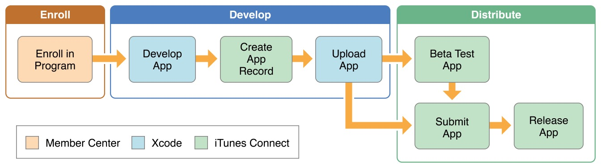

#APP-Distribution-Guide（App上架指南）

翻译，go~知识是人类进步的阶梯

>本文适用于已经阅读过 App Distribution Quick Start 对苹果开发流程和证书相关有一定了解的同学

本指南涵盖了你发布应用到App Store、Apple TV App store、或者Mac App Store时你需要的一切知识。

 * 按照指示步骤，一步步完成注册开发者、开发、测试、提交至商店等系列流程。

 * 当某些服务只能用于上架的App时，配置好这些服务。

 * 在多个设备和系统版本测试你的应用程序,或提供测试人员你的下一个版本的预览

 * 上传提交关于app的原始数据，这样商店才能展示给用户。

 * 确认你准备好的应用无误，上传构建版本并提交至商店。

 * 学习如何发布和上架后如何维护应用。

